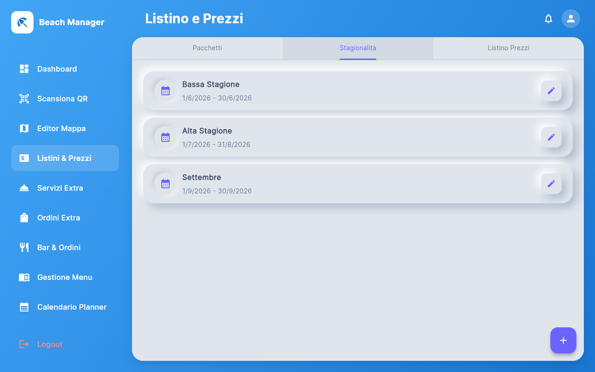
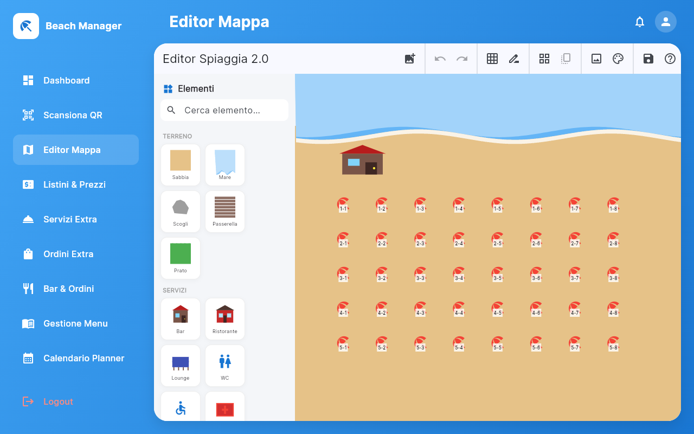
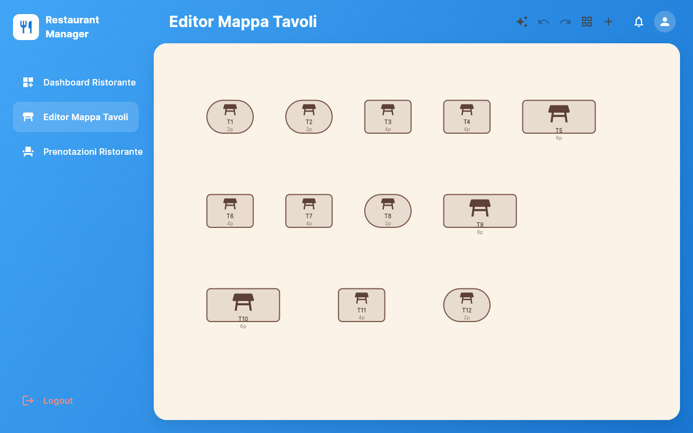
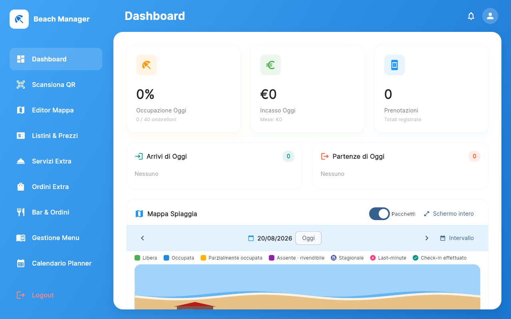
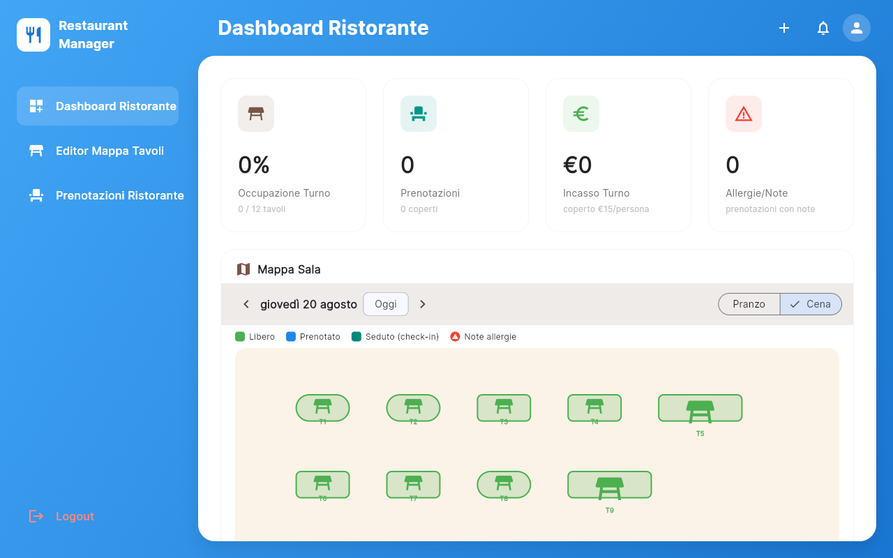
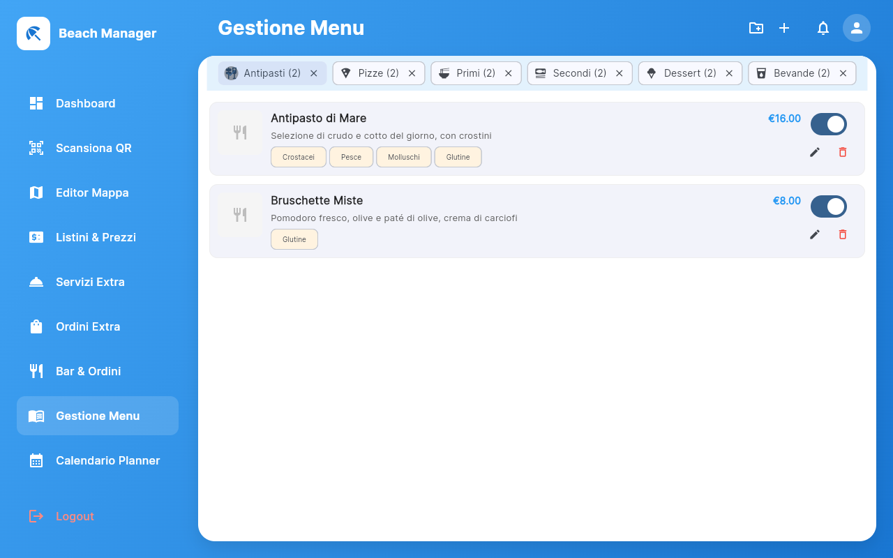
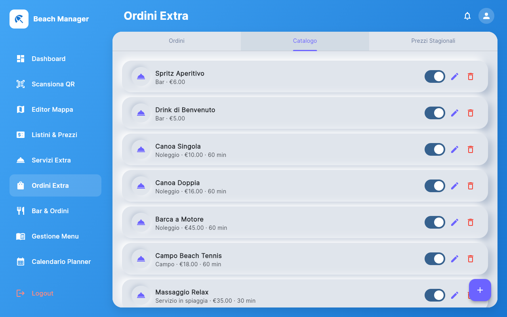

# 🏖️ Beach Manager

**[🇮🇹 Leggi questo in Italiano](README.md)**

A functional prototype of a beach club management platform: umbrella/sunbed booking with a seasonal pricing engine, an operator dashboard with a live map, a restaurant module (tables, menu, bookings), and an on-demand extra-services marketplace (bar orders, rentals, beach services) orderable in real time from the customer app.

> **Project status:** technical prototype/demo, not a production-ready product. See [Current limitations](#current-limitations) before evaluating it for real-world use.

---

## Why this project

Between 2020 and the end of 2022 I worked at an IT company building a booking system for beach clubs and the corresponding management software for the operator. I joined the team when the product had already generated around €300,000 in transactions over the previous two years. After thoroughly analyzing the existing system, I identified the limits of the original idea and proposed expanding it toward a broader market within the same industry — work that in my first few months contributed to growing transactions to €3,600,000, and which over the following two years grew past €4,600,000.

This project was born in those very first months of the collaboration: a Flutter prototype meant to show that an emerging technology at the time could be the answer to bringing more modernity to a system that had only ever been a web application, finally giving it a real cross-platform app. That collaboration ended at the end of 2022; since then I've kept developing and expanding the project independently, to give it the complete shape you see today — a system that covers not just booking a single spot, but the entire ecosystem of a real beach club: restaurant, bar, rentals, ancillary services, all integrated into a single platform for both operator and customer.

## Screenshots

<p align="center">
  
  
</p>

## What this project demonstrates

### Customer journey: booking an umbrella

Date selection → package choice → live-availability map.

<p align="center">
  
  
</p>

### Pricing engine

- Multiple packages per spot (e.g. umbrella + 2 sunbeds, or umbrella + king-size bed + director's chair), each with its own independent price
- Prices differentiated by weekday / Friday / Saturday / Sunday, independently configurable
- Freely creatable seasonal sub-periods (e.g. "Low Season" May 20–June 15), each with its own price list — with overlap prevention between seasons
- Prices also differentiated by row/zone of the umbrella

<p align="center">
  
</p>

### Map editor (beach and restaurant)

- Visual drag-and-drop editor with full undo/redo (move, resize, rotate, delete, batch operations)
- Overlap detection: a spot can't be dragged onto another already-occupied one
- Multi-select with automatic alignment and distribution
- Guided grid generation for spots/tables, zone management, custom background

<p align="center">
  
  
</p>

### Operator dashboard

- Live map of the venue with real-time status for a single date or a date range (free / occupied / seasonal / last-minute / checked-in)
- Automatic cross-reference: the operator sees whether a customer also has bookings in the other module (beach ↔ restaurant)
- Separate roles: beach manager and restaurant manager have independent logins and dashboards

<p align="center">
  
  
</p>

### Restaurant module

- Tables, lunch/dinner shifts, allergy notes, bill and payment
- Menu split by category (starters, pizzas, first courses, mains, desserts) with photos, descriptions, allergens, and minimum-order notes

<p align="center">
  
  
</p>

### Extra services marketplace

- Bar orders, timed rentals (single/double canoe, motorboat), beach tennis court, at-umbrella services (massage, welcome aperitivo) — all sharing the same seasonal pricing engine
- Ordered from the customer app, received instantly by the operator with a notification badge

<p align="center">
  
  
</p>

### Restaurant table booking (customer app)

<p align="center">
  
</p>

## Tech stack

- **Flutter Web** (Dart)
- **Provider** for state management
- **go_router** for routing
- Local persistence via `shared_preferences` (demo-grade, not a real backend)

## Getting started

```bash
flutter pub get
flutter run -d chrome
```

### Demo accounts

| Role | Email | Password |
|---|---|---|
| Customer / Beach manager | `demo@beach.com` | any |
| Restaurant manager | `ristorante@beach.com` | any |

## Current limitations

This is a technical prototype, not a production-ready product:

- **No backend**: all data lives in memory and in the browser's `localStorage` — no multi-device or true multi-user sync
- **Demo authentication**: login accepts any password, not a real security system
- **Simulated payments**: the Stripe/PayPal integration is mocked, no real transaction ever occurs
- **Test coverage**: good on business logic (pricing engine, bookings, orders), absent on end-to-end/UI tests

## License

**All rights reserved.** The code is public and viewable for portfolio/demonstration purposes, but no right to copy, modify, use, or distribute it is granted without the author's written permission. See [LICENSE](LICENSE).

Are you a company or recruiter interested in this project, in a commercial license, or in collaborating with / hiring the author? Get in touch on [LinkedIn](https://www.linkedin.com/in/giuseppe-lobbene-39566a5b/) or via email: [giuseppelobbene@gmail.com](mailto:giuseppelobbene@gmail.com).
