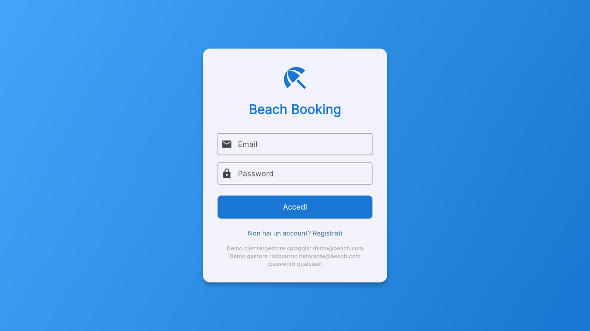
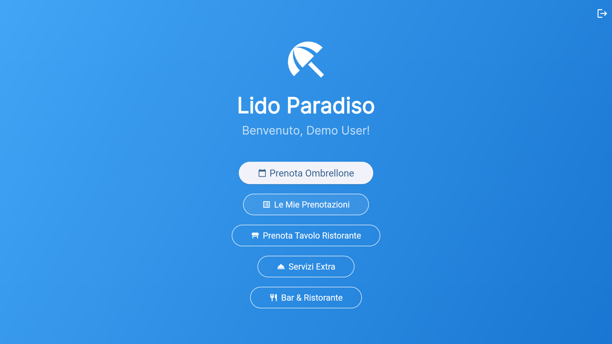
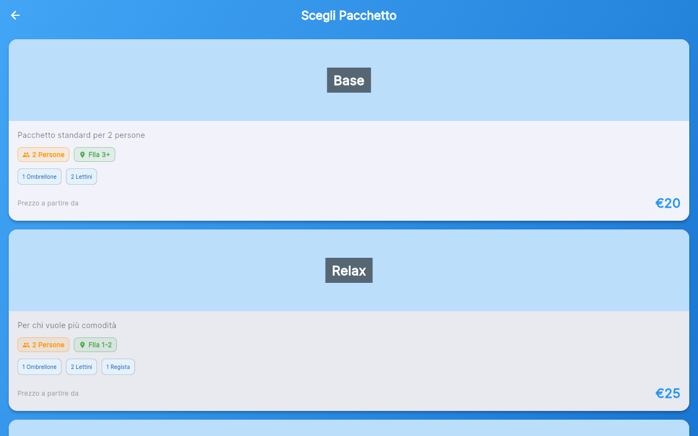
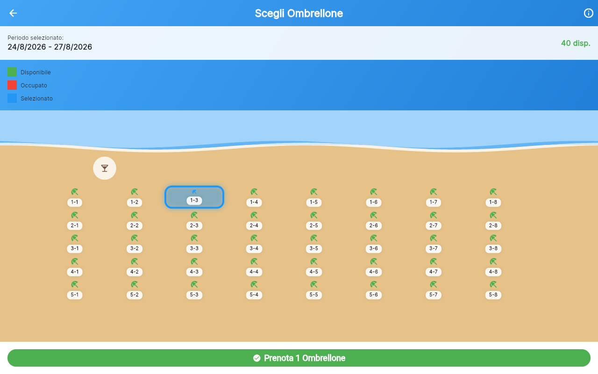
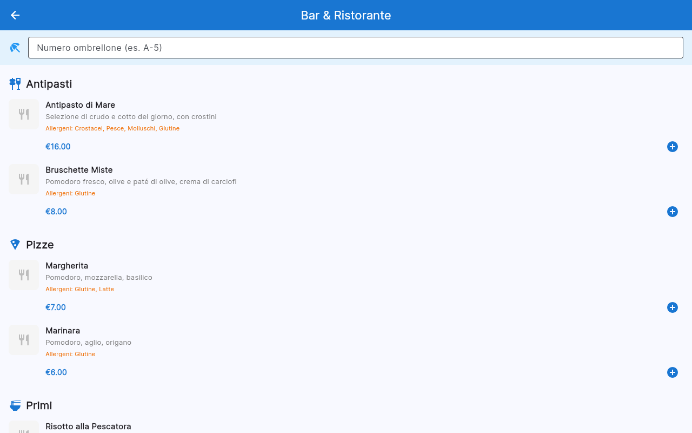
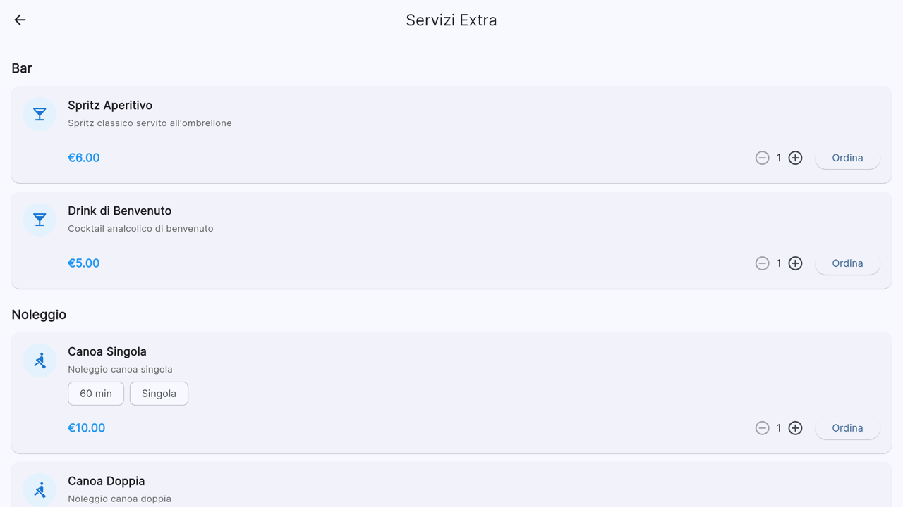
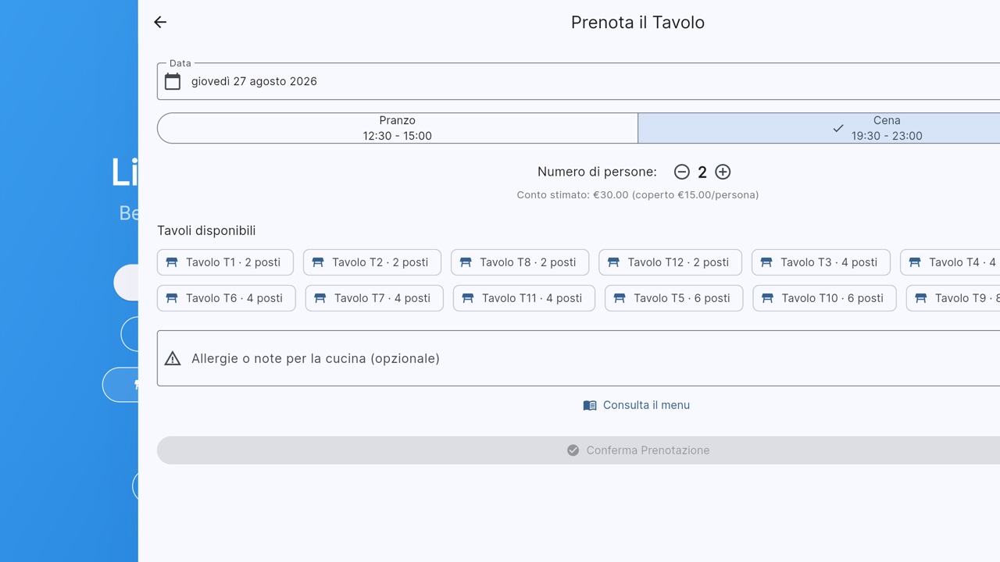

# 🏖️ Beach Booking

**[🇬🇧 Read this in English](README.en.md)**

App Flutter **lato cliente** per la prenotazione di un vero stabilimento balneare: scelta ombrellone/postazione con motore prezzi stagionale, prenotazione tavolo al ristorante, ordini dal menu bar/ristorante, e un marketplace di servizi extra a consumo (noleggi, servizi in spiaggia) — tutto ordinabile in tempo reale.

> **Stato del progetto:** prototipo/demo tecnico, non un prodotto pronto per la produzione. Vedi [Limiti attuali](#limiti-attuali) prima di valutarlo per un uso reale.

Questo repository è il **lato cliente** di una piattaforma a due app: il gestionale per l'operatore (mappa live, editor postazioni, motore prezzi, dashboard ristorante) vive in un repository separato, [beach-manager-app](https://github.com/lobbenedesign/beach-manager-app). Le due app condividono lo stesso motore dati/prezzi ma sono pensate per pubblici e flussi completamente diversi: qui non c'è alcuna funzionalità di amministrazione.

---

## Perché questo progetto

Tra il 2020 e la fine del 2022 ho lavorato in un'azienda IT che sviluppava un sistema di prenotazione per stabilimenti balneari e il relativo gestionale per l'operatore. Sono entrato nel team quando il prodotto aveva già generato circa 300.000€ di transato nei due anni precedenti. Analizzando a fondo il sistema esistente ho identificato i limiti dell'idea originale e proposto un ampliamento delle funzionalità verso un mercato più ampio dello stesso settore — un lavoro che nei miei primi mesi contribuì a una crescita del transato fino a 3.600.000€, e che nei due anni successivi arrivò a superare i 4.600.000€.

Questo progetto nasce proprio in quei primi mesi di collaborazione: un prototipo Flutter per dimostrare che una tecnologia allora nascente potesse essere la soluzione per portare più modernità a un sistema pensato solo come applicazione web, dandogli finalmente un'app multipiattaforma reale. Quella collaborazione si è conclusa alla fine del 2022; da allora ho continuato a sviluppare e ampliare il progetto in autonomia. Questo repository isola la parte rivolta al cliente finale del sistema completo.

## Screenshot

<p align="center">
  
  
</p>

## Cosa dimostra questo progetto

### Prenotazione ombrellone

Selezione date → scelta pacchetto → mappa con disponibilità in tempo reale, prezzi differenziati per pacchetto, giorno della settimana, stagione e fila/zona.

<p align="center">
  
  
</p>

### Ordini bar & ristorante

Menu diviso per categoria (antipasti, pizze, primi, secondi, dessert) con foto, descrizione, allergeni; ordine inviato in tempo reale al gestore.

<p align="center">
  
</p>

### Marketplace servizi extra

Bar, noleggi a tempo (canoa singola/doppia, barca a motore), campo beach tennis, servizi all'ombrellone (massaggi, aperitivo) — stesso motore di prezzi stagionale del gestionale, ordinabili in autonomia dall'app.

<p align="center">
  
</p>

### Prenotazione tavolo ristorante

<p align="center">
  
</p>

## Stack tecnico

- **Flutter Web** (Dart)
- **Provider** per la gestione dello stato
- **go_router** per il routing
- Persistenza locale via `shared_preferences` (demo, non un backend reale)

## Come avviarlo

```bash
flutter pub get
flutter run -d chrome
```

### Account demo

| Ruolo | Email | Password |
|---|---|---|
| Cliente | `demo@beach.com` | qualsiasi |

## Limiti attuali

Questo è un prototipo tecnico, non un prodotto pronto per la produzione:

- **Nessun backend**: tutti i dati vivono in memoria e in `localStorage` del browser — non c'è sincronizzazione multi-dispositivo né multi-utente reale
- **Autenticazione demo**: il login accetta qualsiasi password, non è un sistema di sicurezza reale
- **Pagamenti simulati**: l'integrazione Stripe/PayPal è mockata, nessuna transazione reale avviene
- **Copertura test**: buona sulla logica di business (motore prezzi, prenotazioni, ordini), assente sui test end-to-end/UI
- **Nessuna funzionalità di amministrazione**: per la mappa live, l'editor postazioni e la dashboard gestore vedi [beach-manager-app](https://github.com/lobbenedesign/beach-manager-app)

## Licenza

**Tutti i diritti riservati.** Il codice è pubblico e consultabile a scopo dimostrativo/portfolio, ma non è concesso alcun diritto di copia, modifica, uso o distribuzione senza autorizzazione scritta dell'autore. Vedi [LICENSE](LICENSE).

Sei un'azienda o un recruiter interessato a questo progetto, a una licenza d'uso commerciale, o a collaborare/assumere l'autore? Contattami su [LinkedIn](https://www.linkedin.com/in/giuseppe-lobbene-39566a5b/) o via email: [giuseppelobbene@gmail.com](mailto:giuseppelobbene@gmail.com).
